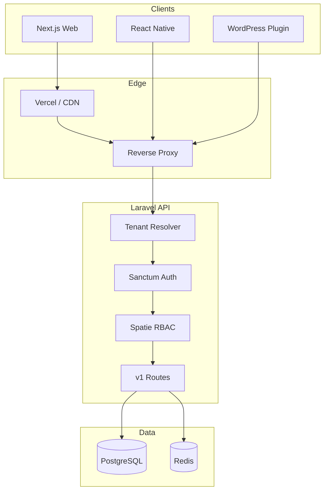

# Architecture Overview

## Design principles

1. **Single database, tenant-scoped rows** — One PostgreSQL cluster; every tenant-owned record carries `tenant_id`. Global tables (plans, super-admin) are explicitly separated.
2. **API-first** — Laravel exposes versioned JSON APIs consumed by Next.js, React Native, and WordPress plugin clients.
3. **Domain resolution at the edge** — Host header resolves tenant before business logic runs.
4. **RBAC with portal context** — Spatie Permission with `team_id` = `tenant_id` for tenant-scoped roles.
5. **Integration boundaries** — Payments (Paystack, Flutterwave), SMS (MNotify), and analytics are adapter-based contracts, not inline calls.

## High-level diagram

## Backend layers (`backend-laravel`)

| Layer | Path | Responsibility |
|-------|------|----------------|
| HTTP | `app/Http/Controllers/Api/V1/` | Thin controllers |
| Middleware | `app/Http/Middleware/` | Tenant resolution, portal guards |
| Domain | `app/Domain/` | Business rules (future) |
| Models | `app/Models/` | Eloquent + scopes |
| Support | `app/Support/` | TenantContext, helpers |
| Integrations | `app/Integrations/` | Payment/SMS/analytics adapters |
| Routes | `routes/api/v1/` | Versioned route files |

## Frontend layers (`frontend-nextjs`)

| Layer | Path | Responsibility |
|-------|------|----------------|
| App Router | `src/app/` | Portal route groups |
| Features | `src/features/` | Domain UI modules (future) |
| Components | `src/components/` | Shared + Shadcn UI |
| Lib | `src/lib/` | API client, auth, tenant utils |
| Config | `src/config/` | Portals, navigation, constants |

## API versioning

- Base: `/api/v1`
- Mobile: same version, `Accept: application/json`, Bearer token
- WordPress: `/api/v1/integrations/wordpress/*` with API key auth
- Webhooks: `/api/v1/webhooks/{provider}` (unsigned routes, signature middleware)

## Multi-tenant resolution order

1. Custom domain (`book.salonname.com`) → `tenant_domains`
2. Workplace subdomain + path slug (`workplace.app.com/acme`) → tenant by slug
3. Super-admin host (`app.com/admin`) → no tenant context

## Security baseline

- Sanctum personal access tokens + SPA cookie mode for web
- CORS restricted to known frontend origins
- Rate limiting on auth and webhook routes
- Tenant isolation enforced in middleware + global scopes
- Secrets only in server env (never `NEXT_PUBLIC_*` for private keys)
